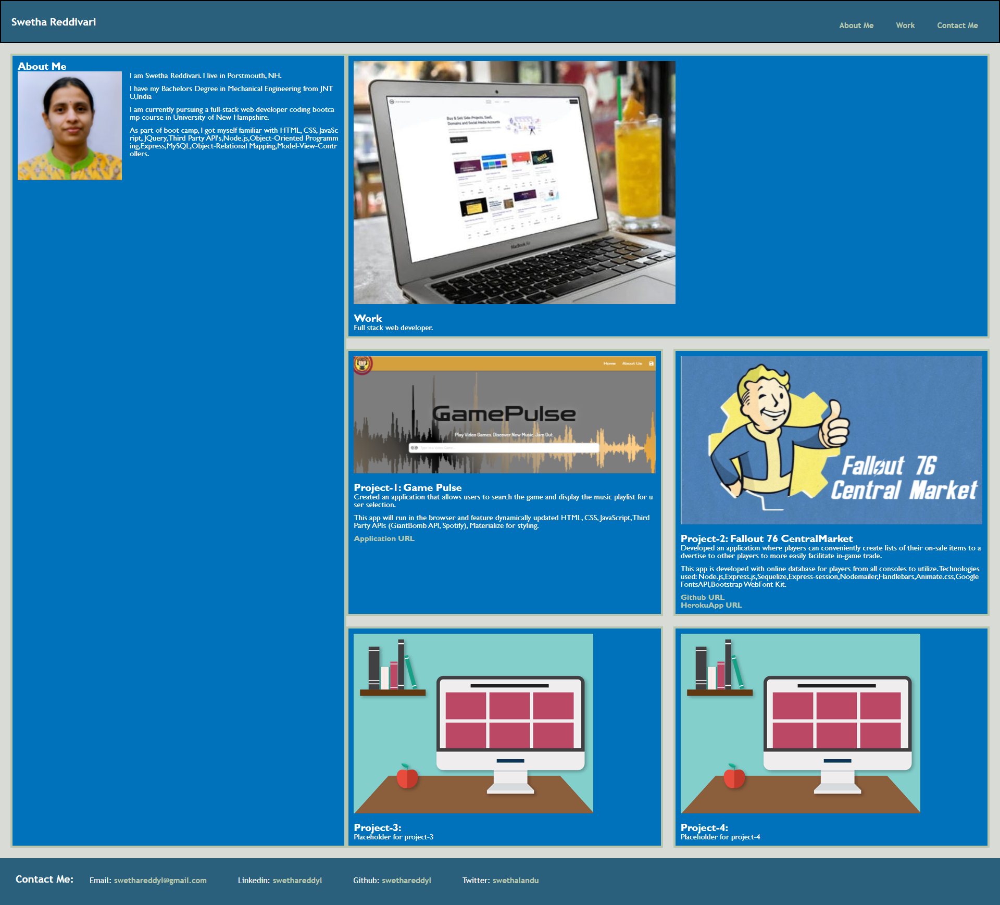

# 02 Advanced CSS: Portfolio

## Your Task

Create a web application from scratch! Build a portfolio page, which can improvised as the course progresses. 
Apply the following advanced CSS concepts while building the page: flexbox, media queries, and CSS variables.

**Note:** As I don't have enough web applications to showcase at this point, used placeholder images and names. I will change them to real applications as I create them later in the course.

## User Story

As the employer visits the page, employee's portfolio page should display the work samples so that employer should be able to review the samples of employee work and assess whether the employee is a good candidate for an open position

## Acceptance Criteria

1. When I view the employee portfolio page, I am presented with the developer's name,  a recent photo, and links to sections about them, their work, and how to contact them

2. When I click on of the links in the navition, the UI scrolls to the corresponding section. 

3. When I move to a particular section, the section is highlighted and able to click

4. When I click on the link to the section about their work, the UI scrolls to a section with titled images of the developer's applications - TBD

5. When I resize the page or view the site on various screens and devices, I am presented with a responsive layout that adapts to my viewport

**Accessibility Standards**
1. When I view the source code, I find semantic HTML elements.

2. When I view the structure of the HTML elements, I find that the elements follow a logical structure independent of styling and positioning.

3. When I view the image elements, I find accessible alt attributes

4. When I view the heading attributes, they fall in sequential order

5. When I view the title element, I find a concise, descriptive title 

6. When I review the code, CSS advanced features linke flexbox, media queries, and CSS variables are utilized.

## Mock-Up

The following animation shows the web application's appearance and functionality:

## URL of the website 
https://swethareddyl.github.io/swethareddivari/  

## Github link 
https://github.com/swethareddyl/swethareddivari.git 

